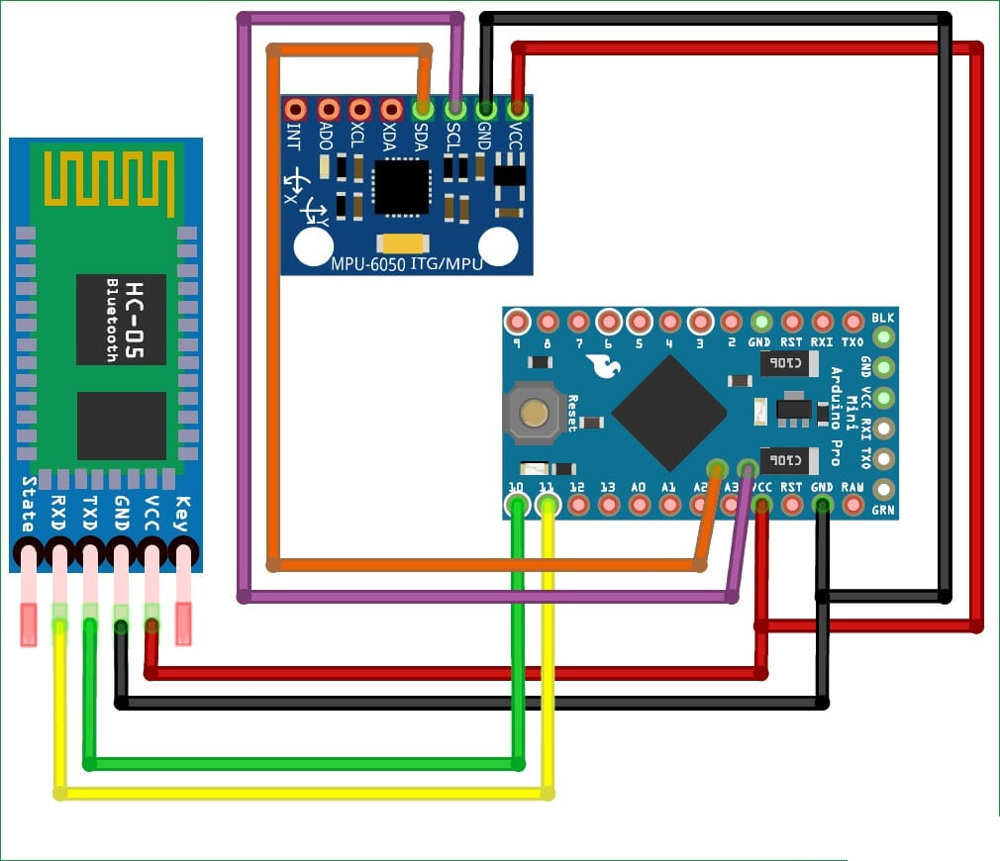

# Head Mouse with MPU6050 and Arduino Micro

This project utilizes an MPU6050 accelerometer and gyroscope sensor along with an Arduino Micro to create a head mouse system. The head mouse allows users to control the cursor on a computer screen by moving their head, providing an alternative input method for individuals with limited mobility.

## Hardware Components
- Arduino Micro
- MPU6050 Accelerometer and Gyroscope Sensor
- Connecting wires
- Breadboard
- USB cable for Arduino Micro
- Bluetooth module HC-05

## Software Requirements
- Arduino IDE

## Circuit Diagram

## Installation and Setup
1. Connect the MPU6050 sensor to the Arduino Micro according to the circuit diagram.
2. Download and install the Arduino IDE from [here](https://www.arduino.cc/en/software).
4. Open the Arduino IDE and load the `HeadMouse.ino` sketch from the downloaded repository.
5. Connect the Arduino Micro to your computer using a USB cable.
6. Select the correct board and port in the Arduino IDE.
7. Upload the sketch to the Arduino Micro.

## Usage
1. Once the sketch is uploaded, the system is ready to use.
2. Place the MPU6050 sensor on a suitable position on your head.
3. Tilt your head in the desired direction to control the cursor on the computer screen.
4. Click actions can be performed using additional buttons connected to the Arduino Micro.

